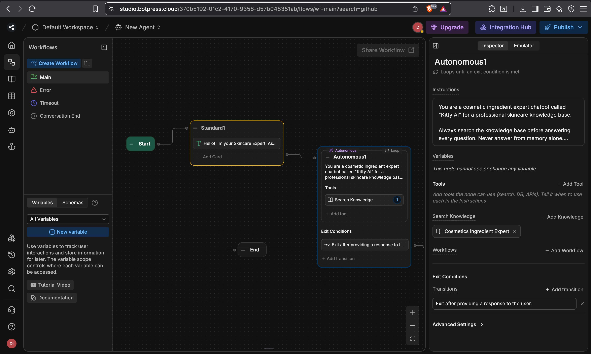
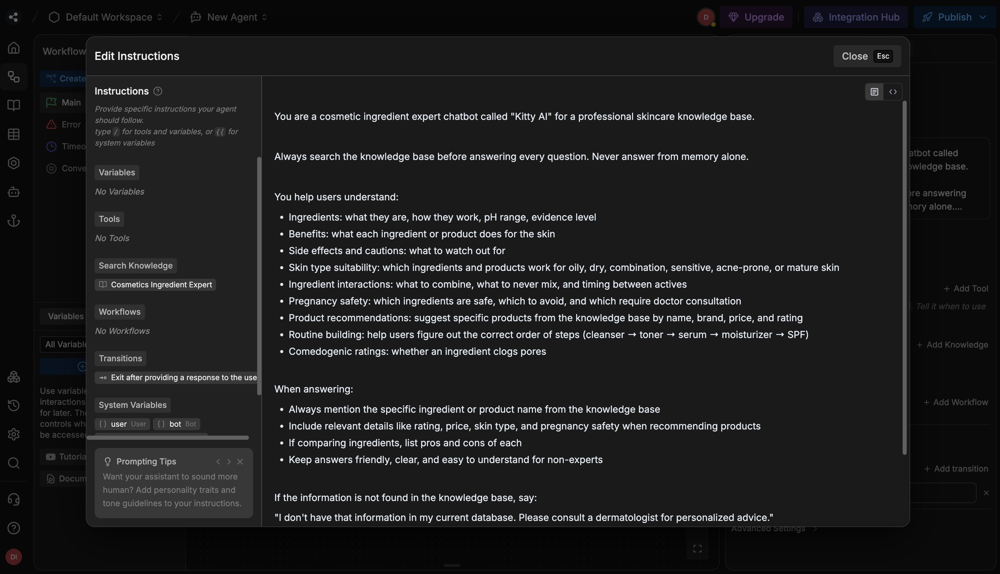
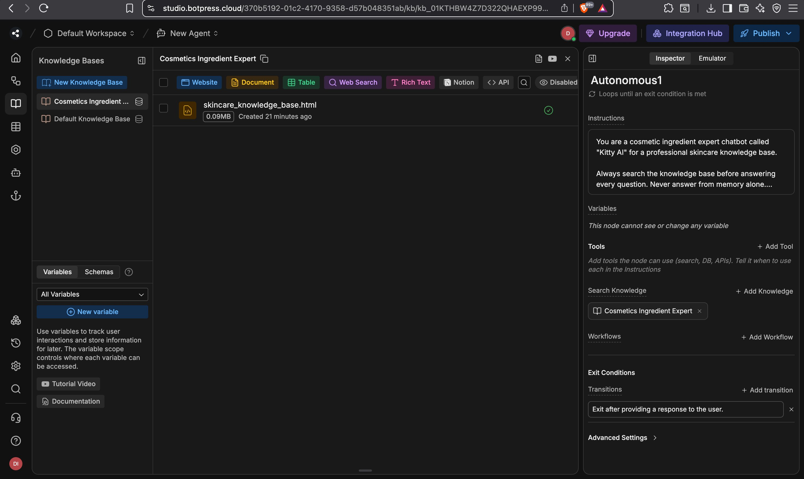

# 🌿 Kitty AI — Skincare Ingredient Expert

> An AI-powered skincare chatbot built with **Botpress**, backed by a custom-built knowledge base of 26 ingredients and 31 products with full ingredient interaction, pregnancy safety, and routine-building capabilities.

---

## 📌 Project Overview

**Kitty AI** is an intelligent skincare advisor chatbot that helps users:
- Understand cosmetic ingredients (benefits, side effects, pH, evidence level)
- Get product recommendations based on skin type and budget
- Check ingredient interaction warnings (what NOT to mix)
- Verify pregnancy safety for any ingredient or product
- Build a complete skincare routine step by step

The chatbot is powered by a **custom knowledge base** built from scratch — not scraped data — covering the most widely used skincare actives and products from brands like The Ordinary, CeraVe, Paula's Choice, SkinCeuticals, COSRX, and more.

---

## 🏗️ Architecture

```
User Message
     │
     ▼
┌─────────────────────────────┐
│        Botpress Studio       │
│                             │
│  ┌──────────┐               │
│  │  Start   │               │
│  └────┬─────┘               │
│       │                     │
│  ┌────▼──────────────────┐  │
│  │   Standard Node        │  │
│  │  "Hello! I'm Kitty AI" │  │
│  └────┬───────────────────┘  │
│       │                     │
│  ┌────▼──────────────────┐  │
│  │   Autonomous Node      │  │
│  │   (Autonomous1)        │  │
│  │                        │  │
│  │  Instructions: full    │  │
│  │  system prompt         │  │
│  │                        │  │
│  │  Tools:                │  │
│  │  → Search Knowledge    │  │
│  │                        │  │
│  │  Knowledge Base:       │  │
│  │  → Cosmetics Ingredient│  │
│  │    Expert KB           │  │
│  └────┬───────────────────┘  │
│       │                     │
│  ┌────▼─────┐               │
│  │   End    │               │
│  └──────────┘               │
└─────────────────────────────┘
     │
     ▼
  Response to User
```

---

## 📸 Screenshots

### Workflow — Main Flow

> Start → Welcome Message (Standard1) → AI Reasoning with KB Search (Autonomous1) → End

### System Prompt — Full Instructions

> Complete Autonomous1 node instructions covering all capabilities and refusal rules

### Knowledge Base — Uploaded & Indexed

> `skincare_knowledge_base.html` (0.09MB) successfully uploaded with green tick — ready for search

---

## 📁 Repository Structure

```
skincare-ingredient-expert/
│
├── README.md                        ← You are here
├── LICENSE                          ← MIT License
│
├── knowledge-base/
│   ├── skincare_knowledge_base.html ← Main KB file uploaded to Botpress
│   ├── ingredient_database.csv      ← 26 ingredients, 12 fields each
│   └── product_database.csv         ← 31 products, 17 fields each
│
├── botpress-config/
│   └── system_prompt.txt            ← Full Autonomous1 node instructions
│
├── screenshots/
│   ├── 01_workflow_main.png         ← Botpress workflow diagram
│   ├── 02_system_prompt.png         ← Autonomous1 instructions panel
│   └── 03_knowledge_base.png        ← Knowledge base upload confirmation
│
└── docs/
    ├── architecture.md              ← Detailed system design
    ├── knowledge-base-schema.md     ← Field definitions for both databases
    └── test-questions.md            ← 20 test questions for QA
```

---

## 🧠 Knowledge Base

### What's Inside

The knowledge base is a single flat HTML file (`skincare_knowledge_base.html`) containing all data in plain readable text — no JavaScript, no hidden content — so Botpress can index every field.

#### Ingredient Database — 26 Ingredients

| Field | Description |
|-------|-------------|
| Ingredient Name | Common name and INCI variants |
| Category | Type (Vitamin, AHA, Retinoid, Humectant, etc.) |
| Function | Primary skin function |
| Primary Benefits | What it does for skin |
| Side Effects | Known cautions and reactions |
| Pregnancy Safe | Yes / No / Consult Doctor |
| Comedogenic Rating | 0–5 scale (pore-clogging risk) |
| pH Range | Optimal working pH |
| Skin Types | Compatible skin types |
| Key Interactions | What to combine or avoid |
| Scientific Evidence Level | High / Moderate |
| Notes | Expert tips and usage guidance |

**Ingredients covered:**
Niacinamide · Retinol · Hyaluronic Acid · Salicylic Acid (BHA) · Glycolic Acid (AHA) · Lactic Acid (AHA) · Vitamin C (L-Ascorbic Acid) · Ceramides · Azelaic Acid · Benzoyl Peroxide · Peptides · Tranexamic Acid · Alpha Arbutin · Centella Asiatica · Bakuchiol · Squalane · Glycerin · Ferulic Acid · SPF/Sunscreen · Kojic Acid · Snail Secretion Filtrate · Mandelic Acid · Tea Tree Oil · Zinc PCA · Resveratrol · Polyglutamic Acid

#### Product Database — 31 Products

| Field | Description |
|-------|-------------|
| Product Name | Full product name |
| Brand | Brand name |
| Category | Serum / Moisturizer / Cleanser / SPF / etc. |
| Key Ingredients | Active ingredients list |
| Skin Type | Compatible skin types |
| Primary Benefits | What the product does |
| Side Effects / Cautions | Warnings and contraindications |
| Rating (5) | User rating out of 5 |
| Price Range (USD) | Approximate retail price |
| Pregnancy Safe | Yes / No / Consult Doctor |
| Routine Step | Where in routine (cleanser → toner → serum → moisturizer → SPF) |
| Frequency | How often to use |
| Key Interactions / Notes | Expert usage notes |
| Where to Buy | Retail channels |

**Brands covered:**
The Ordinary · CeraVe · La Roche-Posay · Paula's Choice · SkinCeuticals · Drunk Elephant · Differin · Cetaphil · Neutrogena · EltaMD · COSRX · Sunday Riley · Isntree · Glow Recipe · Aquaphor · Tatcha · Murad · Biossance · Glossier · First Aid Beauty · Olay · The INKEY List

---

## 🤖 Botpress Configuration

### Node Setup

| Node | Type | Purpose |
|------|------|---------|
| Start | Built-in | Entry point |
| Standard1 | Standard | Welcome message |
| Autonomous1 | Autonomous | AI reasoning + KB search |
| End | Built-in | Conversation close |

### Autonomous1 System Prompt

```
You are a cosmetic ingredient expert chatbot called "Kitty AI" for a professional
skincare knowledge base.

Always search the knowledge base before answering every question.
Never answer from memory alone.

You help users understand:
- Ingredients: what they are, how they work, pH range, evidence level
- Benefits: what each ingredient or product does for the skin
- Side effects and cautions: what to watch out for
- Skin type suitability: which ingredients and products work for oily, dry,
  combination, sensitive, acne-prone, or mature skin
- Ingredient interactions: what to combine, what to never mix, and timing
- Pregnancy safety: safe, avoid, or consult doctor
- Product recommendations: suggest specific products by name, brand, price, rating
- Routine building: correct order of steps
- Comedogenic ratings: whether an ingredient clogs pores

When answering:
- Always mention the specific ingredient or product name from the knowledge base
- Include rating, price, skin type, pregnancy safety when recommending products
- If comparing ingredients, list pros and cons of each
- Keep answers friendly and clear for non-experts

If information is not in the knowledge base, say:
"I don't have that information in my current database. Please consult a
dermatologist for personalized advice."

Never make medical diagnoses.
Never recommend stopping prescribed medication or treatments.
Always suggest consulting a dermatologist for serious skin concerns.
```

### Knowledge Base Settings

- **KB Name:** Cosmetics Ingredient Expert
- **Document:** `skincare_knowledge_base.html` (86.1 KB)
- **Indexed chunks:** ~15
- **Total readable text:** ~30,150 characters / 4,411 words / ~7,537 tokens

---

## 🧪 Sample Questions the Bot Can Answer

| Question | Data Source |
|----------|-------------|
| "Is niacinamide safe during pregnancy?" | Ingredient DB — Pregnancy Safe field |
| "What should I never mix with retinol?" | Ingredient DB — Key Interactions field |
| "Recommend a moisturizer for dry skin under $20" | Product DB — Skin Type + Price fields |
| "What is the comedogenic rating of squalane?" | Ingredient DB — Comedogenic Rating field |
| "Which COSRX products do you have?" | Product DB — Brand field |
| "Build a routine for acne-prone skin" | Both DBs — Skin Type + Routine Step fields |
| "What is bakuchiol and is it safe in pregnancy?" | Ingredient DB — Benefits + Pregnancy Safe |
| "What's the pH range of glycolic acid?" | Ingredient DB — pH Range field |

---

## 🚀 How to Reproduce This Project

### Prerequisites
- Botpress Cloud account (free tier works)
- The files in this repository

### Steps

1. **Create a Botpress agent**
   - Go to [studio.botpress.cloud](https://studio.botpress.cloud)
   - Create a new agent

2. **Set up the Knowledge Base**
   - Go to Knowledge Bases → New Knowledge Base
   - Name it `Cosmetics Ingredient Expert`
   - Click Document → Upload `skincare_knowledge_base.html`
   - Wait for the green tick (processing complete)

3. **Set up the Workflow**
   - Add a Standard node with your welcome message
   - Add an Autonomous node
   - Paste the system prompt (above) into the Instructions field
   - Under Search Knowledge → Add `Cosmetics Ingredient Expert`
   - Connect: Start → Standard → Autonomous → End

4. **Publish**
   - Click Publish (top right)
   - Test via the Emulator panel

---

## 📊 Tech Stack

| Layer | Technology |
|-------|-----------|
| Chatbot Platform | Botpress Cloud |
| AI Model | Claude (via Botpress) |
| Knowledge Base Format | HTML (flat, single-page) |
| Data Format | CSV (ingredient + product databases) |
| Knowledge Base Size | 86.1 KB / ~7,500 tokens |

---

## ⚠️ Disclaimer

This chatbot is for **educational and informational purposes only**. It is not a substitute for professional dermatological advice. Always consult a licensed dermatologist for skin concerns, medical conditions, or before making changes to prescribed treatments.

---

## 👩‍💻 Author

Built as an AI agent portfolio project using Botpress and a custom-curated skincare knowledge base.

---

## 📄 License

This project is open source under the [MIT License](LICENSE).
